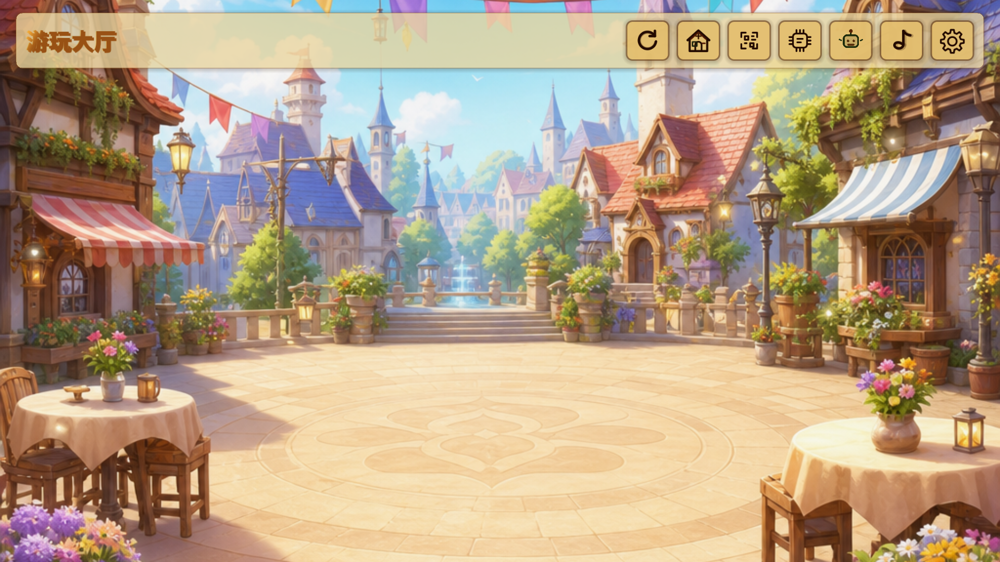
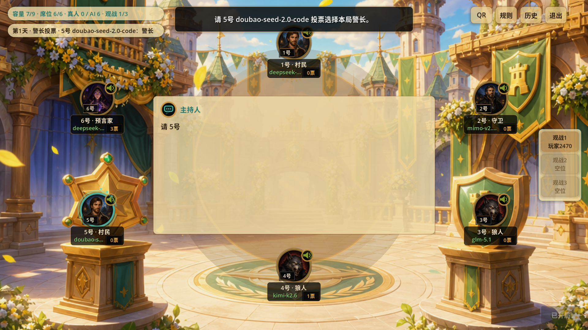
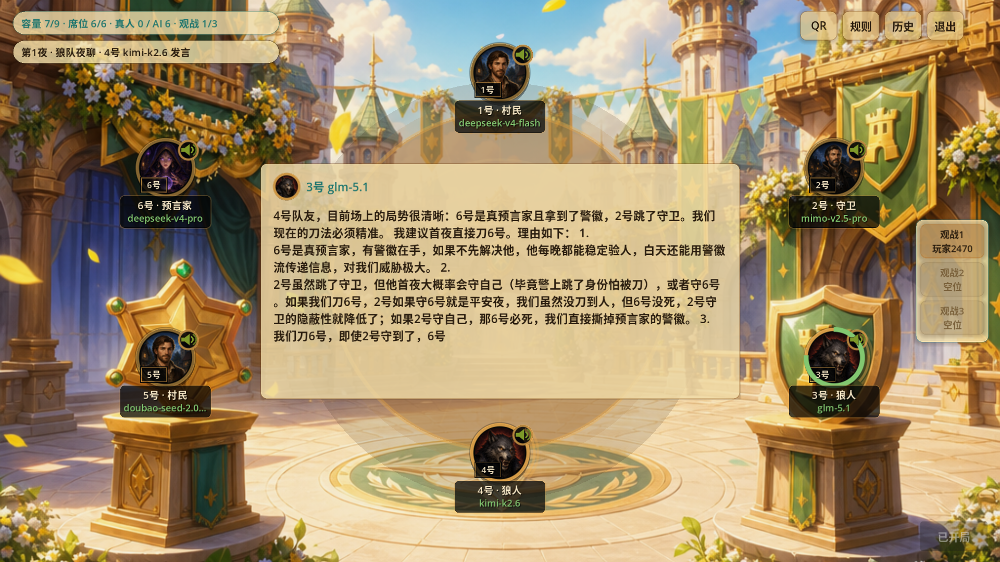

# Play With Me

Play With Me 是一个 Godot 4.6 横屏移动端桌游应用。当前核心玩法是狼人杀，支持局域网大厅、创建房间、扫码加入、WebSocket 房间同步、断线重连、AI 机器人、偏好设置、模型配置、TTS 播报、复盘和 Android 原生能力。

## 游戏截图

<p>
  
  
  
</p>

## TODO

- [x] 本机 + AI 一起游戏
- [x] 局域网一起游戏
- [ ] 增加地图
- [ ] 三国杀接入
- [ ] 象棋接入
- [ ] 围棋接入
- [ ] 麻将接入

## 开源协议

本项目使用 MIT License 开源，详见 [LICENSE](LICENSE)。

## 文档入口

项目文档分两层组织：工程目录结构描述文件系统归属，程序模块结构描述业务逻辑边界。
顶层工程目录保持现有 Godot 项目结构；`scripts/`、`scenes/`、`assets/`、`test/` 等目录内部按模块归属组织文件。

- [文档总入口](docs/README.md)：推荐阅读顺序和文档归档规则。
- [工程目录结构](docs/project-structure/README.md)：Godot 工程、Android 插件、构建脚本、测试和生成物目录。
- [整体架构](docs/architecture.md)：系统分层、技术栈、运行时结构和模块边界。
- [程序模块结构](docs/modules/README.md)：按业务模块组织逻辑边界；房间是通用运行容器，具体游戏以游戏房间模块接入，玩家模块由父级玩家、真人玩家、AI 玩家、狼人杀真人玩家和狼人杀 AI 玩家共同组成。
- [跨模块契约](docs/contracts/README.md)：模块之间的数据对象、可见性、调用结果和变更规则。
- [构建部署](docs/build_deployment.md)：Android 插件、APK 导出和设备安装。
- [维护指南](docs/maintenance.md)：常见改动位置和维护约定。

专题文档放入所属模块目录：

- [二维码、扫码、加密与认证](docs/modules/base/qr_scan_join.md)
- [声音配置与 TTS](docs/modules/tts-voice/voice_config.md)
- [机器人/RAG 接口](docs/modules/bot-management/interfaces.md)
- [功能清单](docs/program_features.md)
- [详细设计历史文档](docs/archive/detailed_design.md)

## 技术栈

- Godot 4.6 Mobile，GDScript。
- Android Kotlin Godot 插件，CameraX、ML Kit、SQLite、系统 TTS、本地 Kokoro/Sherpa。
- UDP 局域网发现，WebSocket 房间通信。
- JSON 消息信封，扫码 v2 使用明文 `IP:端口` 加密房间信息。
- OpenAI API 格式、Ollama、Anthropic、Gemini 模型接口。

## 工程目录

```text
scenes/                         页面场景
scripts/core/                   路由、状态、配置、模型、记忆、TTS、机器人
scripts/network/                局域网发现、网络信封、扫码 payload
scripts/pages/                  大厅、配置页、复盘页
scripts/player/                 玩家模块：父级玩家、真人玩家、AI 玩家和具体游戏玩家实现
scripts/room/                   房间通用运行时
scripts/room/network/           WebSocket 会话、快照、重连副本、参与者注册、房主接管
scripts/room/werewolf/          狼人杀房间模块和当前房间页面
scripts/android/                Godot 到 Android 插件的桥接
scripts/ui/                     通用 UI、二维码生成、扫码处理 UI
android_plugins/play_with_me_android/ Android 原生插件源码
addons/play_with_me_android/    Godot Android 插件产物
docs/                           架构、工程结构、模块和专题文档
test/                           检查脚本、demo 资产和 Android 调试脚本
tools/                          构建、导出、安装和检查脚本
```

## 常用命令

```powershell
powershell -ExecutionPolicy Bypass -File tools\run_godot_check.ps1 test\checks\ui_smoke_check.gd
powershell -ExecutionPolicy Bypass -File tools\build_android_plugin.ps1 -Configuration Debug
powershell -ExecutionPolicy Bypass -File tools\export_android_debug_fast.ps1 -Abi x86_64
powershell -ExecutionPolicy Bypass -File tools\install_android_apk.ps1 -Apk builds\android\play-with-me-debug-x86_64.apk -Device 192.168.1.104:5555
```

## 模块边界

新功能和文档都应按以下层级归档：

基础能力：

- 基础能力：应用路由、共享状态、通用网络、二维码生成、扫码、加密、认证、设备身份、Android 桥接、持久化基础。

基础模块：

- 偏好设置模块：本机偏好黑盒，负责偏好 JSON、昵称、头像、播放声音配置引用和设备私钥只读能力。
- 玩家模块：通用玩家运行黑盒，由父级玩家模块、真人玩家模块、AI 玩家模块、狼人杀真人玩家模块、狼人杀 AI 玩家模块共同组成，负责玩家基础资料、运行时绑定、玩家级可信通道、玩家临时数据、断联恢复、玩家控制器入口和公共 TTS 文本转语音接口。
- 模型管理模块：模型 I/O 黑盒，负责模型配置、供应商列表、配置测试和一次模型输入输出调用。
- 机器人/RAG 模块：通用机器人能力黑盒，内部拆分记忆模块和机器人上下文处理模块，对外提供机器人创建、上下文构建和分层记忆更新能力。
- TTS 语音模块：语音输出黑盒，负责声音配置、文本转语音、播放队列和播放事件。

小编织模块：

- 大厅模块：入口编排黑盒，聚合房间摘要、发现、重连和配置入口。
- 创建房间模块：统一创建 UI 编排，读取可创建游戏房间模块、地图、支持人数和场景槽位，并提交房间创建请求。

大编织模块：

- 房间模块：通用房间运行容器，负责参与者、席位、玩家交互、事件广播、玩家 inbox、可见历史下载、重连、真人副本、主机重选、主机接管和具体游戏房间模块接入点。
- 狼人杀房间模块：当前具体游戏房间实现，负责狼人杀地图、支持人数、场景槽位、内部编排、状态机、行动校验、特效请求、阶段推进、事件 payload、可见性语义、胜负和复盘。
