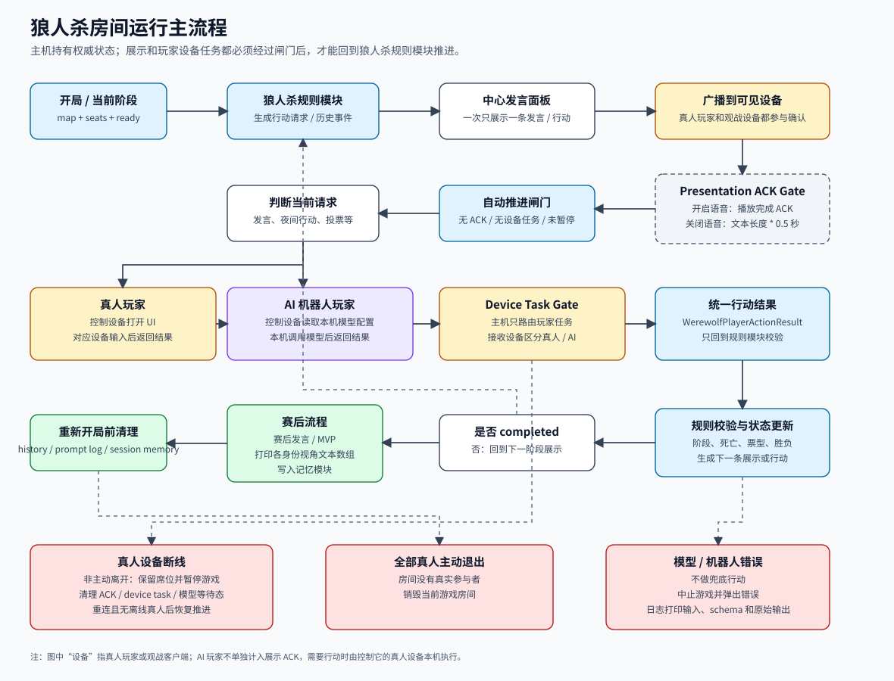

# 狼人杀房间模块

更新时间：2026-05-21

狼人杀房间模块是通用房间模块委派的具体游戏房间模块，负责狼人杀地图、人数、场景槽位、权威状态、行动校验、阶段推进、事件下发、特效请求、胜负判断和复盘回合。它回答“当前这局狼人杀房间如何布局、如何收集玩家行为、如何按玩法规则变化”。

房间模块提供房间上下文、地图、场景槽位和玩家列表；狼人杀房间模块返回游戏房间状态、行动请求、历史事件、临时数据、公开快照和复盘回合数据。它不关心玩家响应来自真人还是 AI 机器人玩家。

玩家响应由 [狼人杀真人玩家模块](../../player/werewolf/human/README.md) 和 [狼人杀 AI 玩家模块](../../player/werewolf/ai/README.md) 通过通用玩家模块收集。房间模块负责网络、加入、重连、玩家 inbox、下发历史、主机重选、主机接管和快照；狼人杀房间模块负责狼人杀的地图、布局、玩法规则、状态推进和下发语义。

跨模块对象 `GameRoomMap`、`GameRoomSceneSlots`、`WerewolfActionRequest`、`WerewolfPlayerActionResult`、`WerewolfRuleUpdateResult` 的字段权威见 [跨模块契约](../../../contracts/README.md)。本文只做入口索引和边界说明。

## 文档结构

| 文档 | 内容 |
| --- | --- |
| [运行流程图](werewolf-flow.svg) | 房主串行推进、展示 ACK、设备任务、AI 输出、暂停恢复和赛后清理总览。 |
| [地图目录](maps/README.md) | 地图拆分规则、地图规则包接口、场景槽位约束和地图索引。 |
| [标准村庄](maps/basic_village.md) | 标准预女猎地图的身份、阶段、行动和推理差异。 |
| [猎人压力村](maps/hunter_pressure_village.md) | 猎人压力地图的身份、阶段、行动和推理差异。 |
| [快节奏村庄](maps/quick_no_witch_village.md) | 无女巫快节奏地图的身份、阶段、行动和推理差异。 |
| [守卫村庄](maps/guard_village.md) | 守卫地图的身份、阶段、行动和推理差异。 |
| [警长广场](maps/sheriff_square.md) | 警长流程地图的身份、阶段、行动和推理差异。 |
| [警长守卫广场](maps/sheriff_guard_square.md) | 警长和守卫同时启用地图的身份、阶段、行动和推理差异。 |
| [对外接口](contracts.md) | 狼人杀房间模块公开接口、核心对象和请求结果。 |
| [行动与校验](actions.md) | 行动目录、行动请求、行动结果和校验顺序。 |
| [阶段编排](phases.md) | 狼人杀阶段状态机、自动跳过和主要流程。 |
| [事件与历史](events.md) | 公开事件、私有事件、狼队事件、复盘回合事件和房间历史分层。 |
| [快照复盘恢复](snapshots.md) | 视角快照、复盘回合数据和主机接管恢复材料。 |
| [实现边界](implementation.md) | 文件归属、目标文件结构和模块维护规则。 |

## 模块定位



```text
房间模块
  -> 狼人杀房间模块
       -> 提供狼人杀地图列表
       -> 提供地图支持人数
       -> 根据地图和人数提供场景槽位
       -> 初始化玩法状态
       -> 发放身份和地图规则配置
       -> 生成玩家行动请求
       -> 接收玩家行动结果
       -> 校验行动合法性
       -> 推进夜晚 / 白天 / 投票 / 遗言 / 赛后
       -> 输出公开事件、私有视角、历史和复盘回合数据
  -> 房间模块包装成快照并同步
```

狼人杀房间模块先锁定为“狼人杀玩法权威 + 创建目录提供者 + 下发数据生产者”。后续真人玩家和 AI 机器人玩家都只能消费它产出的行动请求、下发状态、事件和特效请求。

运行时由房主端持有唯一权威状态。每次规则推进产生的主持人消息、玩家发言或行动展示，都会先进入中心发言面板和历史记录，再广播给当前可见设备。设备根据语音播放完成或文本等待时间回 ACK；ACK gate 打开后，主机才会继续处理下一步。需要玩家输入时，主机只创建 `player_action` 或 `player_speech` 设备任务，并路由到该玩家的控制设备；接收设备根据本机绑定判断是真人 UI 交互还是本机 AI 逻辑。AI 机器人没有独立设备，不参与展示 ACK，但它和真人玩家一样通过设备任务返回统一行动结果。

主机端不发起 AI 模型调用，也不把模型名称、模型配置、API Key、prompt、schema、声音配置、输出兼容、思考兼容、temperature 或 token 参数放入房间快照和设备任务 payload。每台设备只维护自己的本地机器人档案、模型数据库和声音配置；AI 玩家加入房间或重连初始化时，在控制设备本机读取并缓存当前机器人需要的模型配置，后续行动按缓存配置调用基础模型推理能力。

真人设备断线时，进行中的游戏进入暂停状态，清理展示 ACK、设备任务和 AI 等待态，保留席位等待重连。全部真人主动退出时，房间模块销毁当前房间。机器人模型错误、结构化输出错误或设备任务错误不做兜底行动，必须中止当前游戏并暴露错误信息。

## 能力边界

狼人杀房间模块负责：

- 提供狼人杀房间地图列表。
- 根据地图 ID 返回支持人数列表。
- 根据地图 ID 和人数返回场景与槽位布局。
- 根据地图 ID 和人数选择内部地图规则配置、身份配置和阶段编排。
- 维护狼人杀权威状态。
- 管理地图规则配置、身份配置、警长、守卫、女巫、猎人等规则差异。
- 开局发身份并初始化第一阶段。
- 生成玩家行动请求：夜晚行动、警长竞选、警长发言顺序、警徽处理、白天发言、投票、遗言、猎人开枪、赛后总结。
- 接收真人玩家或 AI 机器人玩家返回的统一行动结果。
- 校验行动合法性：行动者、阶段、目标、存活状态、药水、守卫限制、投票资格等。
- 收集游戏数据：夜晚结果、发言、投票、私聊、死亡、胜负和复盘回合数据。
- 保存狼人杀权威结构化数据，并按地图规则包为不同接收者生成不同下发数据。
- 根据预编排的阶段和行动序列推进游戏阶段，并生成下一步行动请求。
- 在行动被接受后输出本次应播放的展示特效请求。
- 输出公开历史、公开事件、私有视角数据和规则临时数据。
- 为房间事件提供狼人杀 payload 和下发语义；事件序号、inbox、补发、下载和副本由房间模块处理。
- 判断胜负并推进到赛后复盘回合。
- 管理中心展示 ACK gate，保证语音播放或文本等待完成后再继续串行推进。
- 编织玩家模块的玩家任务通道，保证行动结果来自被主机指定的控制设备；主机不关心该玩家最终由真人 UI 还是本机 AI 逻辑产生响应。
- 处理真人设备断线暂停、重连恢复和全部真人主动退出后的房间销毁语义。

狼人杀房间模块不负责：

- 房间创建、加入、认证、二维码、扫码、加密和重连。
- 房间网络同步、主机选举、通用快照包装和广播。
- 真人 UI 交互细节。
- AI prompt、模型调用、模型配置和输出解析。
- 机器人长期记忆、记忆检索和记忆更新存储。
- TTS 播放和声音配置。
- 通用玩家资料、设备私钥或偏好设置。

## 本阶段固定能力

- 创建目录：提供狼人杀地图列表、地图支持人数、地图与人数对应的场景槽位。
- 开局权威：根据 `map_id + player_count` 选择地图规则配置、身份配置和阶段编排，并生成初始玩法状态。
- 行动编排：每一步只通过 `WerewolfActionRequest` 下发给玩家适配层，不让玩家侧复制阶段判断。
- 结果入口：只接受 `WerewolfPlayerActionResult`、发言结果或跳过结果，并统一由狼人杀房间模块校验。
- 状态输出：接受结果后返回 `WerewolfRuleUpdateResult`，其中包含玩法状态、事件、历史候选、临时数据、特效请求和下一步行动请求。
- 视角输出：权威数据不直接广播；狼人杀房间模块必须按地图、人数、阶段、事件类型、接收者身份和接收者座位生成下发数据，再由房间模块包装和分发。
- 串行闸门：自动推进必须同时满足未暂停、无展示 ACK 待确认、无玩家任务待返回；本机 AI 模型请求属于接收设备处理玩家任务的内部等待态，必须通过设备任务结果回到主机。
- 赛后顺序：赛后发言和 MVP 结束进入 `completed` 后，先打印各身份视角历史文本数组，再写入记忆模块；下一局开局前清空上一局展示、狼队私聊、prompt 日志和本局会话记忆。

不在本阶段引入三国杀、围棋、象棋或麻将的玩法字段。它们后续只能按同一类公开接口接入，不能把自己的业务字段写入狼人杀房间模块或通用房间模块。

## 与其它模块的关系

| 模块 | 狼人杀房间模块如何交互 |
| --- | --- |
| 房间模块 | 房间提供上下文、玩家列表和输入；规则返回状态、事件、历史、临时数据和快照材料。 |
| 狼人杀真人玩家模块 | 狼人杀房间模块下发预编排行动请求，真人玩家模块返回统一行动结果。 |
| 狼人杀 AI 玩家模块 | 狼人杀房间模块下发预编排行动请求，AI 玩家模块构建上下文、调用模型并返回统一行动结果。 |
| 玩家模块 | 不直接依赖；玩家资料由房间和玩家模块维护。 |
| 机器人/RAG 模块 | 不直接调用；AI 机器人玩家适配层负责映射上下文和记忆更新。 |
| 模型管理模块 | 不直接调用；控制 AI 玩家的设备在 AI 机器人玩家模块内部调用。 |
| TTS 语音模块 | 不直接调用；狼人杀房间模块接受后的公开文本由玩家/TTS 输出链路处理。 |
| 基础能力 | 不直接依赖二维码、扫码、加密或认证实现。 |

## 维护规则

- 地图目录、人数、身份、阶段和推理差异先写到对应地图文档。
- 所有规则变化先更新具体地图规则包文档，再同步公共接口、行动、事件、快照、复盘和实现边界文档。
- 页面按钮、真人玩家和 AI 机器人玩家只提交行动结果，不复制规则判断。
- 地图 ID、人数和阶段编排由狼人杀房间模块内部决定；创建房间 UI、玩家 UI 和玩家适配层不得维护自己的狼人杀编排表。
- 主机端收到玩家回复后，必须先进入狼人杀房间模块校验；只有 `WerewolfRuleUpdateResult(ok = true)` 可以驱动特效请求、阶段推进和下一步行动请求。
- 机器人行动和真人行动走同一狼人杀房间模块校验。
- 下发数据必须由地图规则包按接收者身份、座位、阶段和事件类型生成；隐藏身份、夜晚私密行动、药水使用、守护目标、狼人夜聊等不得从权威数据直接外放。
- 狼人杀房间模块接受前的草稿、模型输出和临时 UI 输入不能写入历史、记忆或 TTS。
